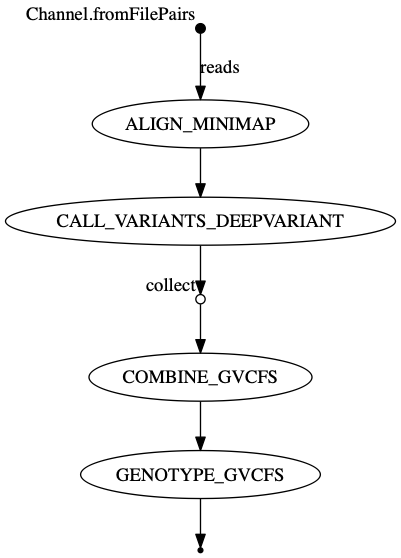
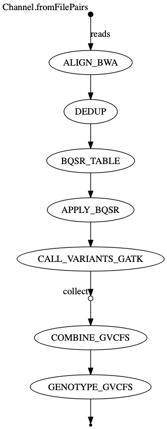
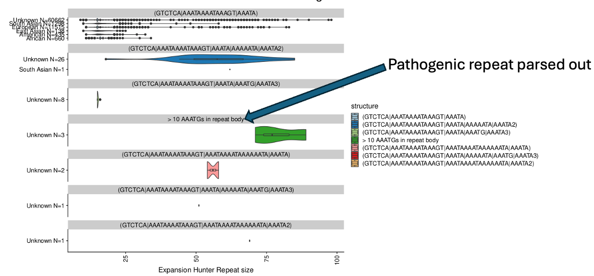

# Run mapping and variant calling using using either GATK or Deepvariant
## run using bwa and gatk
```
sbatch --array=1-$N  map_and_call_variants_submit_jobs.sh samples_to_process.tsv bwa gatk
```
## run using minimap and deepvariant
```
sbatch --array=1-$N  map_and_call_variants_submit_jobs.sh samples_to_process.tsv minimap deepvariant
```

## check jobs ran and produced expected outputs
```
check_job_output.py --prefix ./ --cols 0 --suffix .g.vcf.gz samples_to_process.tsv
cat unfinished_jobs.txt # check log files of any jobs that didn't finish
```

## Nextflow optionality
nextflow run main.nf --aligner minimap2 --caller deepvariant



## Annotate VCF
```
vep \
    --input_file cohort.vcf.gz \
    --output_file cohort.annotated.vcf.gz \
    --vcf \
    --compress_output bgzip \
    --offline \
    --cache \
    --assembly GRCh38 \
    --dir_cache ~/.vep \
    --fasta reference.fa \
    --plugin CADD,annotations/CADD_GRCh38.tsv.gz \
    --plugin AlphaMissense,annotations/AlphaMissense_GRCh38.tsv.gz,cols=all
    --plugin SpliceAI,snv=annotations/spliceai_scores.masked.snv.hg38.vcf.gz \
    --custom annotations/clinvar.vcf.gz,ClinVar,vcf,exact,0,CLNSIG,CLNDN \
    --custom annotations/gnomad.genomes.v3.1.sites.vcf.gz,gnomADg,vcf,exact,0,AF,AF_popmax \
    --fields "Uploaded_variation,Location,Allele,Gene,Feature,Consequence,Protein_position,Amino_acids,CADD-raw,am_pathogenicity,am_class,SpliceAI_pred_DS_AG,SpliceAI_pred_DS_AL"
  ```

## Variant interpretation


### Potentially could try RAMEDIES
from: https://www.nature.com/articles/s41467-025-61712-2
See below exemplary script for computing semantic difference between HPO lists of 2 patients:
https://bitbucket.org/bejerano/phrank/src/master/demo/demo_phrank.py
Subsequently- could use what ever means to assign genes to each patient (e.g. AF<0.001 or CADD>10) and then perform per-cluster enrichment analysis

### Alpha genome could help contextualise variant effect at unprecedented level:
The API is queryable: https://deepmind.google.com/science/alphagenome/api

# Complex variation structural variation and repeat expansions
## Structural variation
Minimap2 + Manta seems to outperform all other SV calling methods:
./SV_caller.sh sample1 sample1_R1.fastq.gz sample1_R2.fastq.gz

## Denovo repeat expansion discovery
While flawed due to the limitations of srWGS- ExpansionHunter denovo can be a powerfull tool to identify deviations in STR motif constitution from reference genome. (Exemplary code only on GEL platform right now. Can be shown if asked.)

Furthermore repeat crawler (https://github.com/chrisclarkson/gel/blob/main/RC_latest.py) can help to assign structure to alleles for subsequent instability analysis.


For methods/details of structure imputation of expanded repeats- see bottom of https://github.com/chrisclarkson/gel/blob/main/README.md


